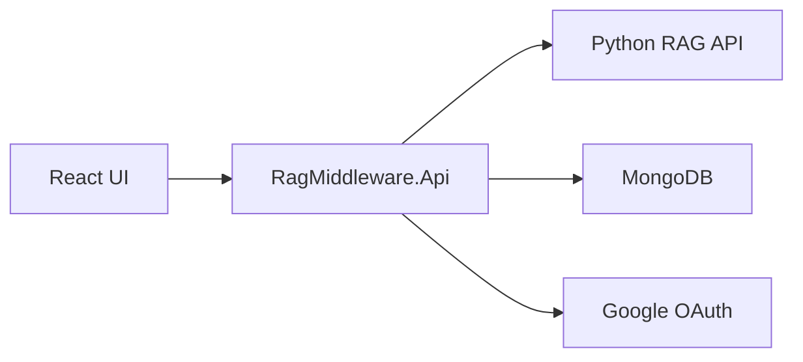

# RAG Middleware API

ASP.NET Core middle-layer API that sits between the React UI and the existing Python RAG API.



## Current Scope

- Mirrors the existing Python endpoints used by `frontend/src/services/ragApi.js`.
- Keeps Python RAG API credentials server-side in `RagApiOptions`.
- Protects RAG endpoints with JWT auth.
- Persists Google-login users in MongoDB.
- Writes audit logs for `/api/auth/*` and `/api/rag/*` traffic.
- Exposes admin-only audit review at `GET /api/admin/audit-logs`.

## Local Prerequisites

- .NET SDK 8+ locally, or .NET 10 SDK if the team chooses to retarget.
- MongoDB database.
- Existing Python RAG API running at `http://127.0.0.1:8000`.
- Google OAuth client ID and secret.

## Secrets

Do not commit real secrets. Use User Secrets locally:

```powershell
cd RagMiddleware/src/RagMiddleware.Api
dotnet user-secrets set "MongoDb:ConnectionString" "mongodb://localhost:27017"
dotnet user-secrets set "MongoDb:DatabaseName" "rag_middleware"
dotnet user-secrets set "RagApi:BaseUrl" "http://127.0.0.1:8000"
dotnet user-secrets set "RagApi:BearerToken" "..."
dotnet user-secrets set "Authentication:Google:ClientId" "..."
dotnet user-secrets set "Authentication:Google:ClientSecret" "..."
dotnet user-secrets set "Jwt:SigningKey" "at-least-32-random-characters-for-hmac"
```

For local Google OAuth, create a **Web application** OAuth client and register this
authorized redirect URI:

```text
http://localhost:5127/signin-google
```

Then configure its credentials from PowerShell:

```powershell
dotnet user-secrets set "Authentication:Google:ClientId" "YOUR_CLIENT_ID" --project RagMiddleware/src/RagMiddleware.Api
dotnet user-secrets set "Authentication:Google:ClientSecret" "YOUR_CLIENT_SECRET" --project RagMiddleware/src/RagMiddleware.Api
```

Restart `RagMiddleware.Api` after setting the secrets. Never commit the client secret
to `appsettings.json`.

Use Azure Key Vault or environment variables for staging/production.

## Run Locally

```powershell
cd RagMiddleware
dotnet restore
dotnet build
dotnet run --project src/RagMiddleware.Api
```

Health checks:

- `GET /health`
- `GET /api/health`

Mongo collections created by the middleware:

| Collection | Purpose |
| --- | --- |
| `users` | Google-authenticated user profiles and roles |
| `audit_logs` | Auth and RAG request audit trail |

Swagger is enabled in development at `/swagger`.

## Existing UI Endpoint Mapping

| UI endpoint | Middleware behavior |
| --- | --- |
| `POST /api/chat` | Forwards request to Python RAG API with server-side RAG credential |
| `POST /api/chat/stream` | Streams Server-Sent Events from Python RAG API |
| `GET /api/conversations` | Proxies conversation list |
| `POST /api/conversations` | Proxies conversation creation |
| `GET /api/conversations/{id}` | Proxies conversation fetch |
| `DELETE /api/conversations/{id}` | Proxies conversation deletion |
| `GET /api/health` | Checks middleware database connectivity |

## Code Review Checklist

- No RAG API credential appears in frontend code, responses, headers, logs, or audit rows.
- No Google OAuth secret or JWT signing key is committed.
- RAG API failures return generic UI-safe errors.
- All RAG endpoints require `[Authorize]`.
- Audit summaries contain metadata only, not full request bodies or tokens.
